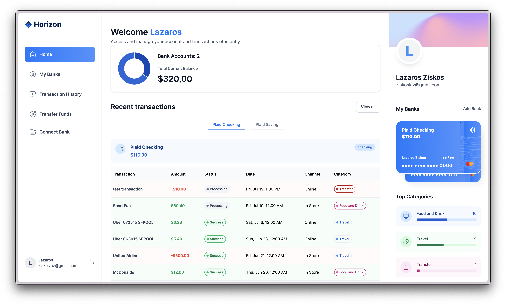
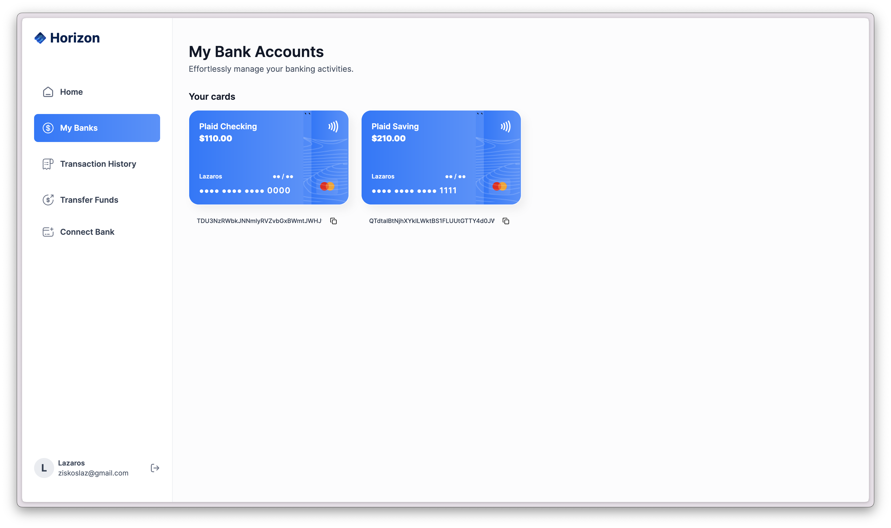
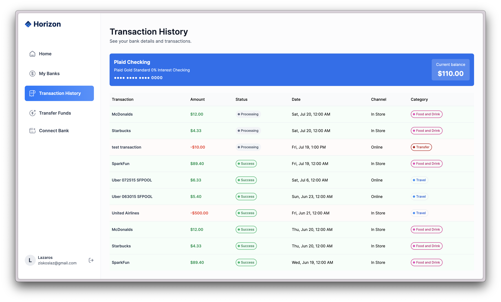
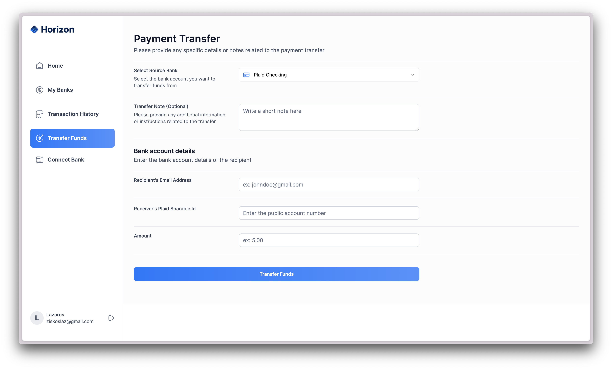

# Horizon Banking Platform

Horizon banking platform is an finance related application that lets the user connect multiple bank accounts and cards to the platform and transfer funds between other users of the platform. Moreover, the user can monitor their financial transactions in real-time and manage their finances altogether.

## Table of Contents

- [Installation](#installation)
- [Usage](#usage)
- [Features](#features)
- [Screenshots](#screenshots)
- [Technologies Used](#technologies-used)
- [Contact Information](#contact-information)
- [Resources](#resources)

## Installation

1. **Clone the repository:**
   ```bash
   git clone https://github.com/LazarosZiskos/banking-app.git
   ```
1. **Navigate to the project directory:**
   ```bash
   cd banking-app
   ```
1. **Install dependencies:**
   ```bash
   npm install
   ```

## Usage

**Run the development server:**

```bash
npm run dev
```

## Features



Authentication: Utilizes an exceptionally secure SSR authentication system with comprehensive validations and authorizations.

👉 **Bank Connectivity** - Employs Plaid for linking multiple bank accounts.

👉 **Dashboard** - Provides a general overview of the user's account, including the total balance from all connected banks, recent transactions, and spending across different categories.

👉 **Linked Banks** - Displays a detailed list of all connected banks along with their respective balances and account information.

👉 **Transaction Log** - Features pagination and filtering options for viewing transaction history across different banks.

👉 **Live Updates** - Automatically updates all relevant pages when new bank accounts are connected.

👉 **Fund Transfers** - Enables users to transfer funds to other accounts via Dwolla, requiring necessary details and the recipient's bank ID.

👉 **Adaptive Design** - Ensures the application adjusts smoothly to various screen sizes and devices, delivering a consistent user experience on desktops, tablets, and mobile devices.

And much more, including robust **code architecture** and **reusability**.

## Screenshots

**Sign In Page**


**Dashboard**


**Connected Banks Page**



**Transactions Page**



**Connect Bank**



### Technologies Used


## Contact Information:

[](https://www.linkedin.com/in/lazaros-ziskos/)
[](https://github.com/LazarosZiskos)

#### Made by Lazaros Ziskos

#### Email: **ziskoslaz@gmail.com**

#### Tel: **+30 6980228219**

## Resources:

- [Next.js](https://nextjs.org/docs) - Explore the powerful features and API of Next.js.
- [React](https://react.dev/) - Dive deeper into the world of React.,
- [Tailwind](https://v2.tailwindcss.com/docs/) - Master the utility-first approach with Tailwind CSS.
- [ShadCN](https://ui.shadcn.com/docs) - Discover the comprehensive UI components offered by ShadCN.
- [Appwrite](https://appwrite.io/docs) - Open-source backend platform.
- [Plaid](https://plaid.com) - World leading data network and payments platform.

### Thank you for reading
